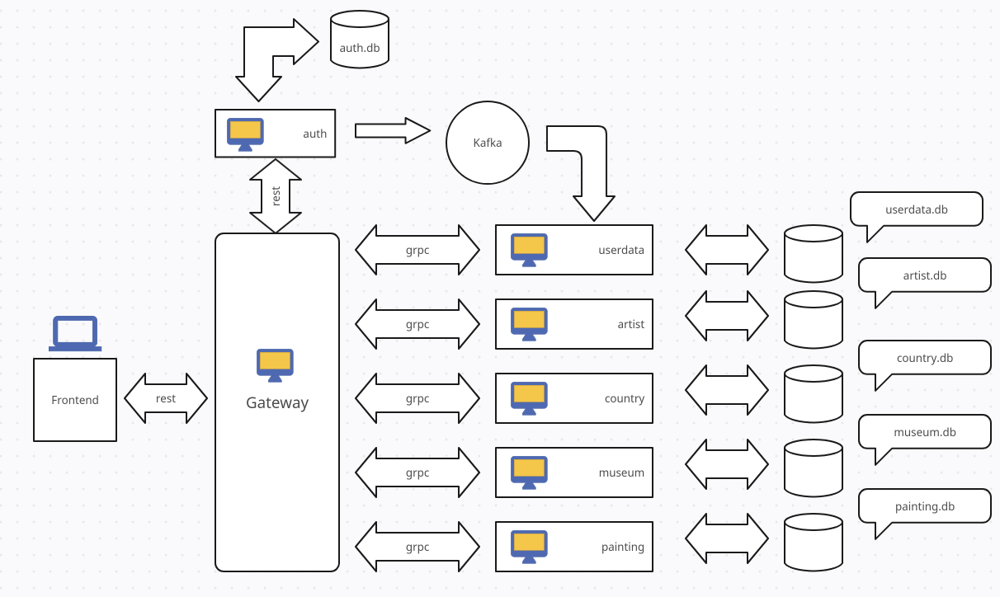
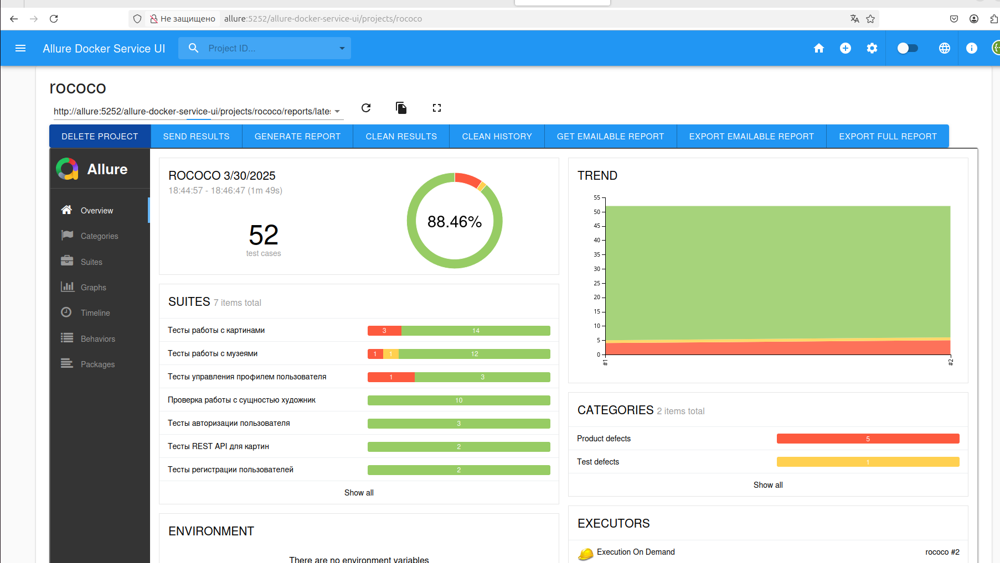

Rococo

Проект представляет собой платформу для работы с произведениями искусства в стиле рококо.

## Технический стек
- Java 21
- Gradle 8.6
- MySQL 8
- Docker

## Структура проекта
Проект состоит из фронтенда и нескольких микросервисов:

**Схема проекта Rococo**



### Фронтенд
- `rococo-client` - клиентская часть приложения

### Микросервисы
- `rococo-gateway` - API Gateway
- `rococo-museum` - сервис музеев
- `rococo-artist` - сервис художников
- `rococo-auth` - сервис аутентификации
- `rococo-country` - сервис стран
- `rococo-painting` - сервис картин
- `rococo-userdata` - сервис пользовательских данных

## Локальный запуск проекта

### Предварительные требования
1. Установить:
    - Java 21
    - Gradle 8.10   
    - Docker
    - Node.js (для фронтенда)


### Локальный запуск сервисов
1. Собрать проект, для этого в консоли перейти в корень проекта и выполнить команду: 
```posh
./gradlew build -x test
```

2. Находясь в корне проекта запустить docker-контейнеры с mysql, kafka и zookeeper командой:
```posh
./localenv.sh
```
Также потребуется создать volume, для сохранения состояния БД после остановки соответствующего контейнера, командой:
```posh
docker volume create mysql-data
```

3. Запуск сервисов бэкэнда на примере сервиса сервис аутентификации:

В консоли выполнить следующие команды:
```posh
cd rococo-auth
gradle bootRun --args='--spring.profiles.active=local'
```

Или через IDE: запустить main-класс приложения RococoAuthApplication 
(Убедиться, что в настройках запуска приложения  в поле Environment variables прописано значение  spring.profiles.active=local)

Аналогичным образом запустить остальные микросервисы

4. Запуск фронтенда
   В консоли выполнить следующие команды:
```posh
cd rococo-client
npm i
npm run dev
```

После запуска всех компонентов можно открыть фронт rococo перейдя по адресу:

http://127.0.0.1:3000/


### Тестирование

Для запуска end-to-end тестов в консоли выполнить следующую команду:

```posh
./gradlew test
```

Либо в IDE нажимаем правой кнопкой мыши по каталогу rococo-e2e и в контекстном меню выбираем пункт Run'Tests in 'rococo.rococo-e2e''

### Генерация отчета Allure

В консоли перейти в корень проекта и выполнить команду

```posh
gradle allureServe
```


## Запуск сервисов в docker

### Предварительные требования

1. Добавить в файл `/etc/hosts` следующие строки:

   - 127.0.0.1 allure
   - 127.0.0.1 selenoid
   - 127.0.0.1 gateway.rococo.dc
   - 127.0.0.1 frontend.rococo.dc
   - 127.0.0.1 auth.rococo.dc
   - 127.0.0.1 artist.rococo.dc
   - 127.0.0.1 country.rococo.dc
   - 127.0.0.1 museum.rococo.dc
   - 127.0.0.1 painting.rococo.dc
   - 127.0.0.1 userdata.rococo.dc


### Запуск сервисов

Для запуска проекта, в консоли в корневой директории проекта выполнить команду:  

```posh
./docker-compose-dev.sh
```
Фронтенд доступен по адресу:

http://frontend.rococo.dc


### Запуск сервисов с e2e тестами


Для запуска проектас e2e тестами, в консоли в корневой директории проекта выполнить команду:

```posh
./docker-compose-e2e.sh
```
Процесс выполнения UI тестов можно посмотреть перейдя на ресурс:

http://127.0.0.1:9091/#/

Результаты автотестов можно посмотреть в allure-отчете по адресу: 

http://allure:5252/allure-docker-service-ui/projects/default


